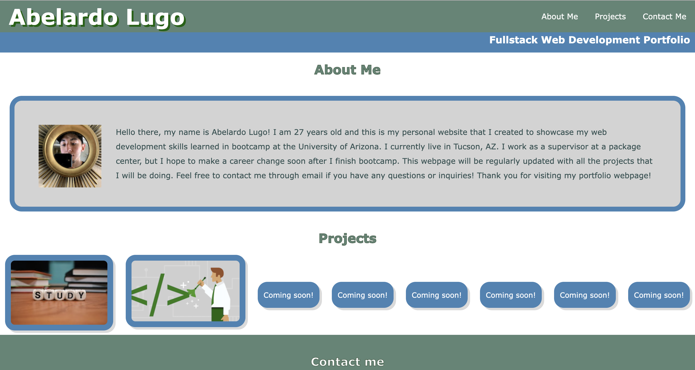

# <Portfolio Project>

## Description
This webpage serves an online portfolio that showcases all the work that I have done in the full-stack web development bootcamp program.
Any visitors are able to interact with the webpage by clicking on the grid boxes with hyperlinks to the previous projects that I have completed.
The user should also be able to visit my webpage on a mobile device or tablet with ease.
This webpage applies both HTML and CSS concepts learned in bootcamp. Finally, since this webpage is in its first stage, expect many more things to change in the next couple of months, as I am still learning new concepts! Thank you for choosing to visit my portfolio!

## Installation
N/A

## Usage
Users only need a browser and have an internet connection on their computer, tablet, or mobile device! 😊 

## Credits
Tutorials used:
1. https://codepen.io/giana/pen/BZaGyP
2. https://www.w3schools.com/css/css_grid.asp
3. https://www.w3schools.com/html/html_links.asp

## License
MIT License